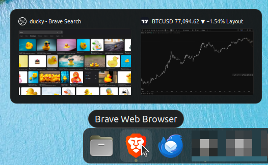

# Brave Aero peek

**Linux / Ubuntu Dock** tab thumbnails for Brave: hover the Brave dock icon and get an Aero-style peek strip.

[](https://ko-fi.com/alkitect/?hidefeed=true&widget=true&embed=true)

**Installed names:** `browser-tabs-host`, user unit `alkitect-browser-tabs.service`, Shell uuid `browser-tab-dock@alkitect`, Brave MV3 “Alkitect Browser Tab Dock”.

## What this does

On **Ubuntu with GNOME Wayland**, the Ubuntu Dock shows window previews on click, but not **per-tab** peeks for Brave. This tool bridges a small Brave extension, a session D-Bus host, and a GNOME Shell extension so hovering the Brave dock icon lists your tabs with favicons and **cached** page thumbnails.



**Safe by default for click behavior:** dock **click** stays stock `minimize-or-previews`. Peek is hover-only. Thumbnails are captures from when a tab was last visible (Chromium cannot screenshot background tabs live).

## Who this is for

- **In:** **Linux** — Ubuntu 22.04 + GNOME Shell 42 **Wayland**, **Ubuntu Dock**, **Brave `.deb`**
- **Not for:** non-Linux; Firefox; Chrome/Edge/Opera/Vivaldi (not wired); Flatpak/Snap Brave; other desktops; replacing global dock click-action

## Quick start

```bash
git clone https://github.com/alkitect/brave-aero-peek.git
cd brave-aero-peek
chmod +x scripts/*.sh
./scripts/install-to-local.sh --enable-automation
./scripts/verify-host-cli.sh
./scripts/verify-dbus.sh
```

**Brave:** `brave://extensions` → Developer mode → Load unpacked → `browser-extension/`. Confirm ID matches `browser-extension/extension-id.txt`. Fully quit and relaunch Brave, then `browser-tabs-host cli list`.

**Shell (Wayland needs logout/in after enable):**

```bash
gnome-extensions enable browser-tab-dock@alkitect
# log out and back in
```

Then hover Brave on the **Ubuntu Dock** (one window, ≥2 tabs). Click the icon still minimize-or-previews.

## Check it works

```bash
./scripts/verify-host-cli.sh
./scripts/verify-dbus.sh
./scripts/verify-shell-fake.sh
# Human checklist after Shell reload:
./scripts/verify-e2e.sh
```

Maintainers: `./scripts/ci-check.sh`.

## Uninstall

```bash
./scripts/uninstall-from-local.sh
```

Does not unload the Brave extension (remove it in `brave://extensions`).

## How it works

| Piece | Role |
|-------|------|
| Brave MV3 | Lists/activates tabs; inlines favicons; caches visible-tab PNG thumbs |
| `browser-tabs-host` | Native messaging ↔ session D-Bus `org.alkitect.BrowserTabs1` |
| Shell extension | Hover dwell on **Ubuntu Dock** → peek strip; Activate + raise window |
| systemd user unit | Owns the host (`WantedBy=graphical-session.target`) |

Versions: MV3 `browser-extension/manifest.json` (public tag tracks this) · Shell `metadata.json` integer (GNOME scheme). Architecture: [docs/ARCHITECTURE.md](docs/ARCHITECTURE.md) · [ADR-001](docs/architecture/ADR-001-ipc-and-dock-intercept.md) · [SECURITY.md](docs/SECURITY.md).

## Limits & safety

- **Linux + Ubuntu Dock + Brave `.deb` only** — other OSes, docks, browsers, and Flatpak/Snap Brave are unsupported.
- **Single Brave window** with ≥2 tabs for peek; multi-window → no tab strip (stock window previews OK).
- **Thumbs are page screenshots** (more sensitive than titles). Same-UID callers on D-Bus or the Unix socket can read titles, favicons, and thumbs — see [SECURITY.md](docs/SECURITY.md).
- Native messaging `allowed_origins` is **one** extension ID. Do not publish `extension.pem` / `manifest-key.txt` (manifest `key` is public on purpose).
- Hover dwell + host rate limits reduce scrub spam.
- This GitHub repo is the **release source** for tagged releases and public docs — see [CONTRIBUTING.md](CONTRIBUTING.md).

## License

GPL-3.0-only — see [LICENSE](LICENSE).

Copyright (C) 2026 alkitect

Optional tip jar: [ko-fi.com/alkitect](https://ko-fi.com/alkitect/?hidefeed=true&widget=true&embed=true)
